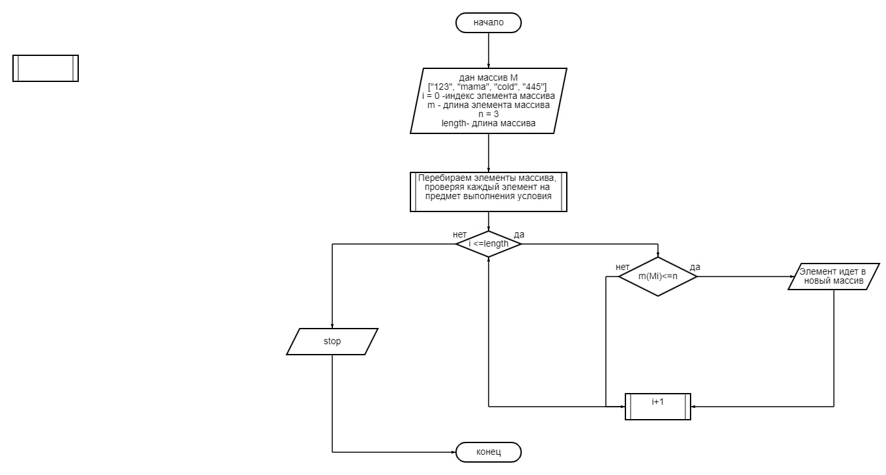

## Задача

Написать программу, которая из имеющегося массива строк формирует массив из строк, длина которых меньше либо равна 3 символа. Первоначальный массив можно ввести с клавиатуры, либо задать на старте выполнения алгоритма. При решении не рекомендуется пользоваться коллекциями, лучше обойтись исключительно массивами.

## Алгоритм решения:
* Перебираем элементы заданного массива М на предмет соответствия условию, что длина элемента меньше 3
* Элементы, соответствующие условию вносим в новый массив N
* Повторяем проверку пока индекс проверямого элемента не будет более длины массива.
* Выводим массив N.

## Блок схема

Перейдя в файл solution Вы увидите программу, решающую задачу.

